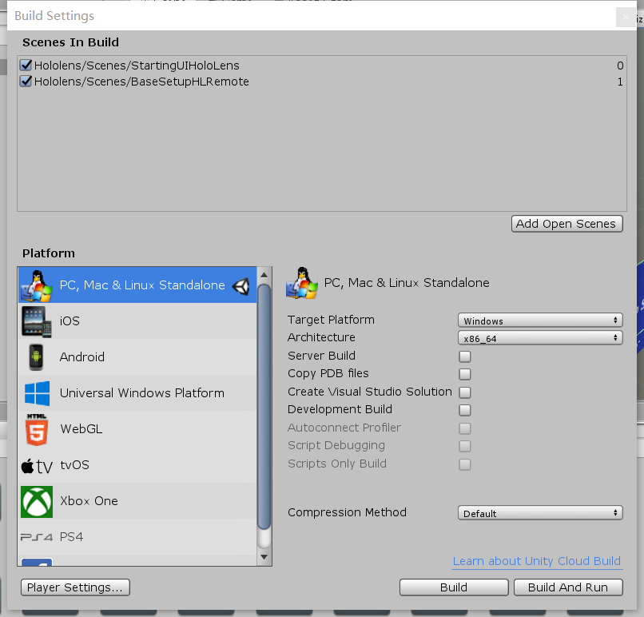

<!-- PROJECT LOGO -->
<br />
<p align="center">
  <a href="https://github.com/othneildrew/Best-README-Template">
    
  </a>

  <h3 align="center">MRVis Documentation</h3>

  <p align="center">
    External AR for Digital display and Remote AR collaborative system
    <br />
    <a href="https://github.com/othneildrew/Best-README-Template"><strong>Explore the docs »</strong></a>
    <br />
    <br />
    <a href="https://github.com/othneildrew/Best-README-Template">View Demo</a>
    ·
    <a href="https://github.com/othneildrew/Best-README-Template/issues">Report Bug</a>
    ·
    <a href="https://github.com/othneildrew/Best-README-Template/issues">Request Feature</a>
  </p>
</p>


<!-- TABLE OF CONTENTS -->
<details open="open">
  <summary>Table of Contents</summary>
  <ol>
    <li>
      <a href="#about-the-project">About The Project</a>
      <ul>
        <li><a href="#built-with">Built With</a></li>
      </ul>
    </li>
    <li>
      <a href="#getting-started">Getting Started</a>
      <ul>
        <li><a href="#prerequisites">Prerequisites</a></li>
        <li><a href="#installation">Installation</a></li>
      </ul>
    </li>
    <li><a href="#usage">Usage</a></li>
    <li><a href="#license">License</a></li>
    <li><a href="#contact">Contact</a></li>
  </ol>
</details>


<!-- ABOUT THE PROJECT -->
## About The Project

[![Product Name Screen Shot][product-screenshot]](https://example.com)


This project is done in 2020 from March to September as a research result at Inria. The project includes two unity projects. One for the monitor application and remote room. The other is for the HoloLens application.

The main function for this project is to build a visualization system in HoloLens and another debug application for remote user testing.

### Built With

This project is using Vuforia library for Augmented reality calibration and Photon Pun for building up the network.
* Unity 2018.4.26f
* [Vuforia](https://developer.vuforia.com/)
* [Photon Pun](https://doc-api.photonengine.com/en/pun/v2/)
* [MRTK](https://github.com/microsoft/MixedRealityToolkit-Unity)


<!-- GETTING STARTED -->
## Getting Started


### Prerequisites

To get start, first remember to install Unity later than version 2018.4.26f. Version mismatch may cause issue.User should have a basic understanding of Unity development and HoloLens deployment.


### Installation

1. Clone the repo
   ```sh
   git clone https://github.com/Big-Bro222/MRvis.git
   ```
2. Open the "DeskTop" Folder and "HoloLens Project" Folder seperately in Unity. Note: open them together may cause crash, it's highly recommand to open one project once at a time.


<!-- USAGE EXAMPLES -->
## Usage

1.Build the HoloLens project folder. Add the starting scene and visualization scene in the Unity's build settings.

2.Follow the instruction of build and deployment on [Mircosoft website.](https://docs.microsoft.com/en-us/windows/mixed-reality/develop/unity/tutorials/holograms-100)

3.To build the monitor application and virtual room, first open the Desktop Folder

4.To build the monitor application, add the starting scene and MonitorView scene in the Unity's build settings.

5.Similar approach for the virtual room application.  <b>Note: there should be at least one virtual room, but can have multiple virtual rooms for different users</b>

For further usage of the applications, please refer to the [Instruction](https://github.com/Big-Bro222/MRvis/blob/master/Documentation/Instruction.pdf) document.
For documentation and better understanding the software struture, please refer to the [documentation](https://github.com/Big-Bro222/MRvis/blob/master/Documentation/MRVisDocumentation.pdf) document.


<!-- LICENSE -->
## License

Distributed under the MIT License. See `LICENSE` for more information.


<!-- CONTACT -->
## Contact

Ze Qi - Ze.Qi@outlook.com

Project Link: [https://github.com/Big-Bro222/MRvis](https://github.com/Big-Bro222/MRvis)


<!-- MARKDOWN LINKS & IMAGES -->
<!-- https://www.markdownguide.org/basic-syntax/#reference-style-links -->
[contributors-shield]: https://img.shields.io/github/contributors/othneildrew/Best-README-Template.svg?style=for-the-badge
[contributors-url]: https://github.com/othneildrew/Best-README-Template/graphs/contributors
[forks-shield]: https://img.shields.io/github/forks/othneildrew/Best-README-Template.svg?style=for-the-badge
[forks-url]: https://github.com/othneildrew/Best-README-Template/network/members
[stars-shield]: https://img.shields.io/github/stars/othneildrew/Best-README-Template.svg?style=for-the-badge
[stars-url]: https://github.com/othneildrew/Best-README-Template/stargazers
[issues-shield]: https://img.shields.io/github/issues/othneildrew/Best-README-Template.svg?style=for-the-badge
[issues-url]: https://github.com/othneildrew/Best-README-Template/issues
[license-shield]: https://img.shields.io/github/license/othneildrew/Best-README-Template.svg?style=for-the-badge
[license-url]: https://github.com/othneildrew/Best-README-Template/blob/master/LICENSE.txt
[linkedin-shield]: https://img.shields.io/badge/-LinkedIn-black.svg?style=for-the-badge&logo=linkedin&colorB=555
[linkedin-url]: https://linkedin.com/in/othneildrew
[product-screenshot]: images/screenshot.png
